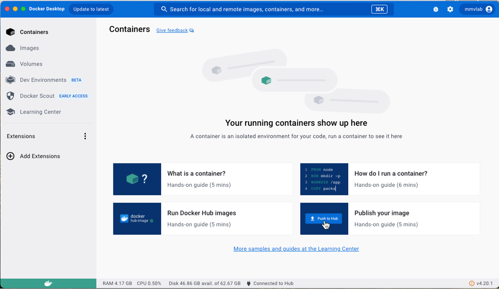
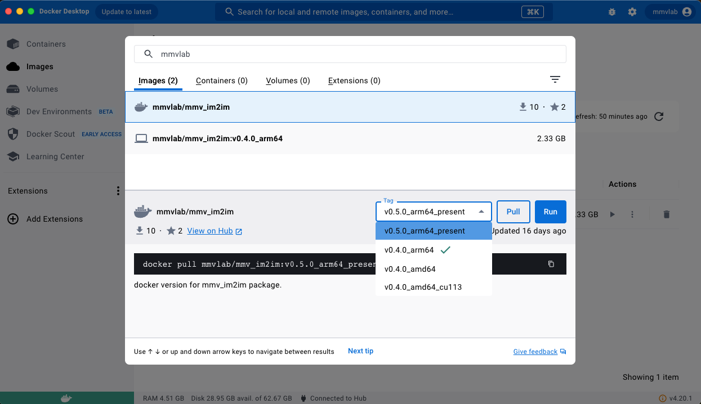
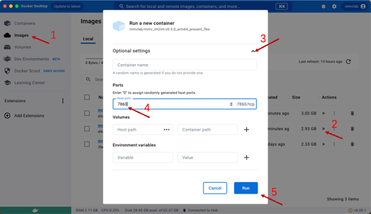
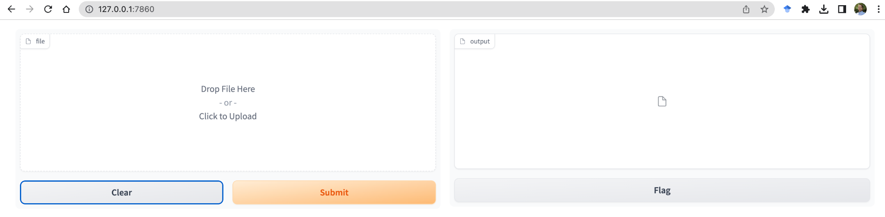
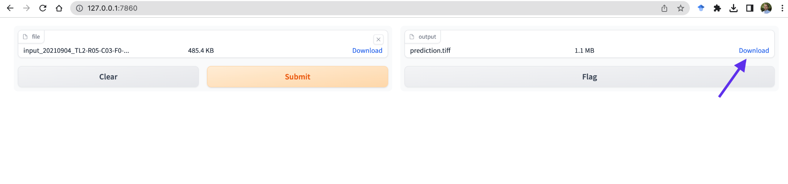
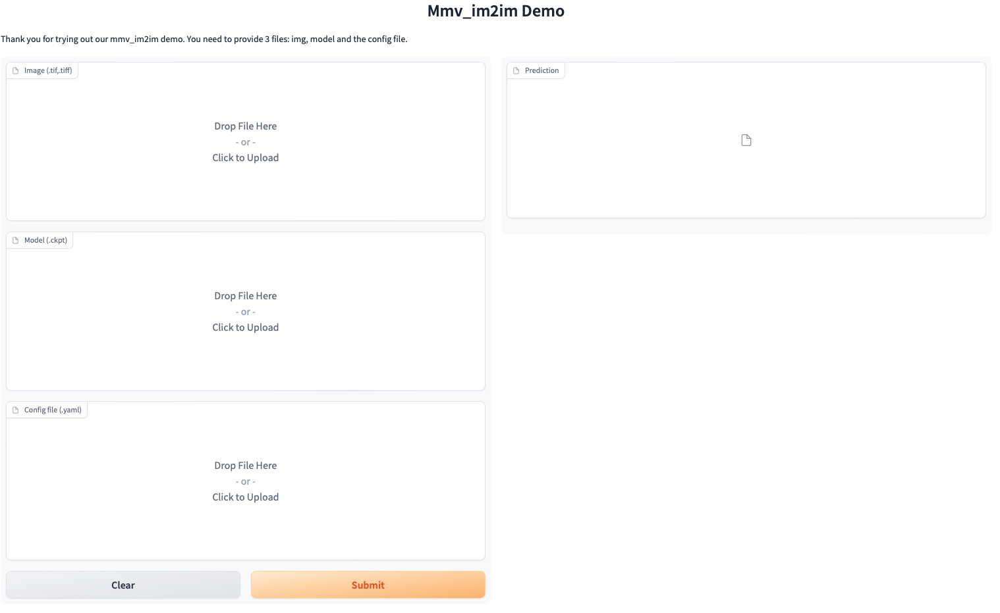
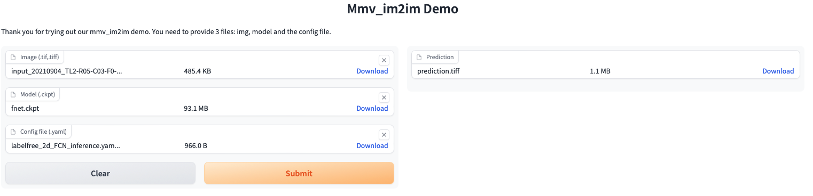

# Caveat

MacOS is not very friendly for running deep learning experiments, as NVDIA GPUs are not supported in Mac, except specially hacked external GPU devices. We strongly recommend Linux (most commonly used on computing clusters or scientific computing workstations) or at least Windows. In the real world applications, for example, the image analysts at a core facility can train a model on the dedicated computing resource at the core facility, e.g., a cluster, and then send the model to users to use in their daily analysis, e.g. on users' own macbook, only doing inference, not training. So, in this demo, we focus on how to apply a trained model on new images with Docker on MacOS.

In addition, the graphical interface is not our current focus. Another dedicated graphical interface on the napari platform is on our development roadmap.

All the models used in the manuscript and sample data can be found in Zenodo: . There are two .zip files,  `models.zip` for the models and `sample_data.zip` for the sample data. You can download and unzip them. Belows we will only provide the relative location in these two folders.

# Run the mmv_docker version on MacOS

This tutorial contains two demos for running our Docker Images on MacOS. The first one requires only data input, while the second one is more flexible, where you can choose the model, data and config files. We will dive into these two demos step by step.

## Demo 1: Run a 2D labelfree model on a new image

Get an example image: `sample_data/exp1_labelfree_prediction_of_nuclear_structure/2d`. This is a subfolder of all sample data prepared for reviewing and demoing. The "input_20210904_TL2-R05-C03-F0-003.tiff" is a sample brightfield image, which can be used for testing in this demo. Then, we can compare the prediction with the ground truth image "input_20210904_TL2-R05-C03-F0-003.tiff".

Steps for running the demo:

1. Open the docker desktop app:

2. search \'mmvlab' in the search box, and find the version "v0.5.0_arm64_present", then pull it.

3. Then we should start this Docker Image:

> 3.1. Find and click on \"Images\" on the sidebar.
>
> 3.2. Click on the triangle button to launch the image pulled just now.
>
> 3.3. Click on the dropdown arrow in optional settings.
>
> 3.4. In the \"Ports\" section, enter 7860. This is the port for later WebUI purposes.
>
> 3.5. Click the \"Run\" button and wait for a moment.
>
> 

4. Open a browser (like safari) and go to: [http://127.0.0.1:7860](http://127.0.0.1:7860). Then, you will see a webpage like the following.

5. Drag the sample image to the input box and click the \'Submit\' button. While the computation is finished (may take about 10\~20 seconds, depending on your machine, i.e. the actual computation is done locally), click the \'Download\' and then you can check your results locally, e.g. on ImageJ.

## Demo 2: Run different models on different images with the corresponding config file

In Demo 1, the model file is already pre-baked in the Docker image which can be run as a "2D labelfree" service APP on MacOS. In this demo, we want to show how to run different models on different images, which can be used as a "general mmv_im2im inference" service APP on MacOS.

We can use the sample image as in Demo 1. For the model checkpoint file, it can be accessed here: `models/labelfree/2d`. The config is released together in the Github repo, if you already clone
the repo locally, it should be also available locally. Otherwise, here is [a direct link](https://github.com/MMV-Lab/mmv_im2im/blob/main/paper_configs/labelfree_2d_FCN_inference.yaml). (Links to other models are listed at the end.)

Steps to run the demo:

The first three steps are the same, just to substitute the image name \'v0.5.0_arm64_present\' with \'v0.5.0_arm64_present_flex\'.

4\. open a browser (like safari) and go to: [http://127.0.0.1:7860](http://127.0.0.1:7860). Now there are three input boxes, namely image (accept .tif, .tiff file), model (accept .ckpt file) and config file (accept .yaml file) and one output box.

5\. Drag or upload the image, model and config file accordingly and click the \'Submit\' button. While the computation is finished, click the \'Download\' and then you can check the result locally, e.g. on ImageJ.

**Note**: It should be noted that these three files should be compatible. For example, the model defined in the config file (i.e. in this case labelfree_2D_FCN_inference.yaml) should be the same as the
model architecture saved in the checkpoint file (fnet.ckpt). Any mismatch could result in errors. Usually, this is not a problem. In the example use case we described at the very beginning, an image analysts trained the model at the core facility computing cluster, and send the model (together with the corresponding config file) to the users, these two files will be always used together (in the simplest case, but can be modified by advanced users for additional functionalities).

Other models and sample data can be tested:

We provided sample data and results as well as models for all the applications we reported in the manuscript. The whole thing can be accessed here: . Here are some examples of matched model / config / data. Testing other models will be similar.

\(1\) staining transformation in multiplex examples:\
\
*Data*:
`sample_data/exp9_staining_transformation` (11_input.tiff is a sample IHC image)

*Config*: [a direct link](https://github.com/MMV-Lab/mmv_im2im/blob/main/paper_configs/multiplex_inference.yaml) to the file on Github

*Model*:
`models/multiplex`. There are three models, we can test any one of them, each predicting a different staining result from the source IHC image.

\(2\) denoising of 3D microscopy images

*Data*:
`sample_data/exp7_image_denoising` (there are subfolders, one for tribolium, one for nucleus. We can take the "input_XXX.tiff" file in the respective folder for testing.)

*Config*: [a direct link](https://github.com/MMV-Lab/mmv_im2im/blob/main/paper_configs/denoising_3d_inference.yaml) to the file on Github

*Model*:
`models/denoising`. There are two models for the tribolium (tribolium.ckpt) and nucleus (planaria.ckpt), respectively.
